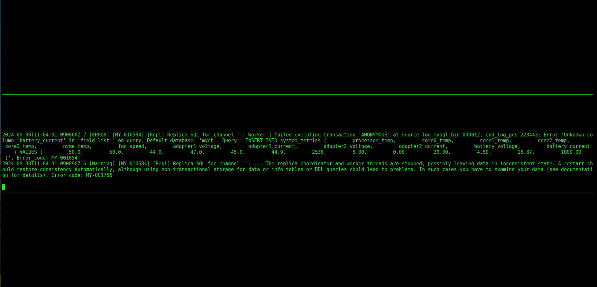
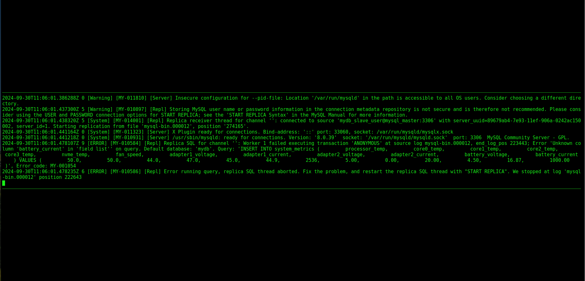
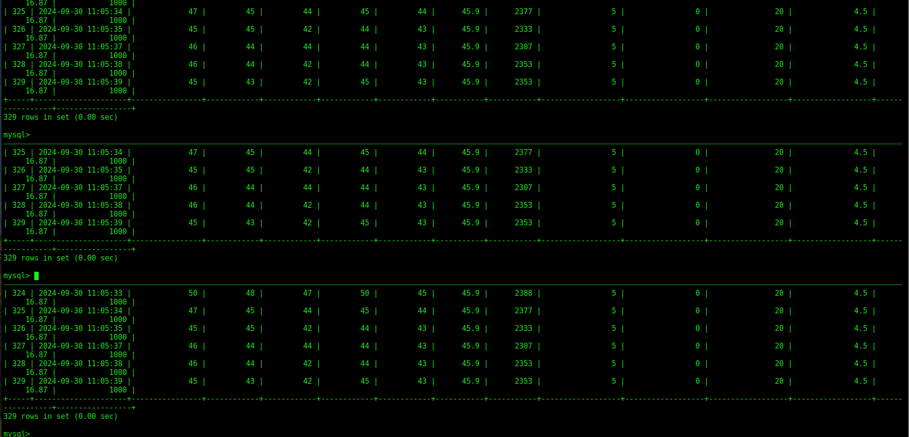
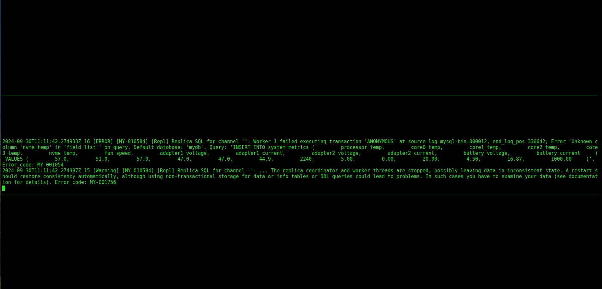
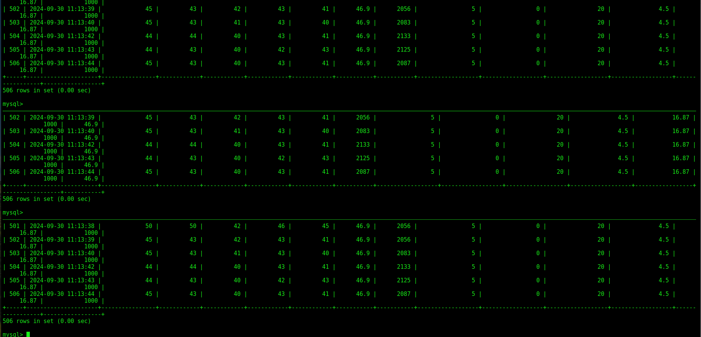

# Projector Home Work 19
========================

MySQL 8.0 master-slave replication with using Docker.

## Run

To run this examples you will need to start containers with "docker compose"

```bash
docker compose up -d
```

#### Add table changes to master

```bash
docker exec mysql_master sh -c "export MYSQL_PWD=111; mysql -u root mydb -e '
    CREATE TABLE system_metrics (
        id INT AUTO_INCREMENT PRIMARY KEY,
        timestamp TIMESTAMP DEFAULT CURRENT_TIMESTAMP,
        processor_temp FLOAT,
        core0_temp FLOAT,
        core1_temp FLOAT,
        core2_temp FLOAT,
        core3_temp FLOAT,
        nvme_temp FLOAT,
        fan_speed INT,
        adapter1_voltage FLOAT,
        adapter1_current FLOAT,
        adapter2_voltage FLOAT,
        adapter2_current FLOAT,
        battery_voltage FLOAT,
        battery_current FLOAT
    );
'"

docker exec mysql_master sh -c "export MYSQL_PWD=111; mysql -u root mydb -e '
    INSERT INTO system_metrics ( processor_temp, core0_temp, core1_temp, core2_temp, core3_temp, nvme_temp, fan_speed,
                                 adapter1_voltage,adapter1_current, adapter2_voltage, adapter2_current, battery_voltage, battery_current )
                                 VALUES ( 49.0, 48.0, 47.0, 49.0, 48.0, 41.9, 2702, 500, 0.00, 20.00, 4.50, 16.87, 1000.00 );
'"
```

#### Read changes from slaves

```bash
docker exec mysql_slave1 sh -c "export MYSQL_PWD=111; mysql -u root mydb -e 'select * from system_metrics \G'"
docker exec mysql_slave2 sh -c "export MYSQL_PWD=111; mysql -u root mydb -e 'select * from system_metrics \G'"
```

#### Run autofilling script (you need 'sensors' installed tool)
```bash
./fill-db.sh
```

#### Remove last column from the table
```bash
docker exec mysql_slave1 sh -c "export MYSQL_PWD=111; mysql -u root mydb -e 'ALTER TABLE system_metrics DROP COLUMN battery_current;'"
```


Log info after restart mysql_slave1.


#### Insert last column from the table
```bash
docker exec mysql_slave1 sh -c "export MYSQL_PWD=111; mysql -u root mydb -e 'ALTER TABLE system_metrics ADD COLUMN battery_current FLOAT; START REPLICA;'"
```


#### Remove column from the middle of table
```bash
docker exec mysql_slave1 sh -c "export MYSQL_PWD=111; mysql -u root mydb -e 'ALTER TABLE system_metrics DROP COLUMN nvme_temp;'"
```


#### Insert column to the table
```bash
docker exec mysql_slave1 sh -c "export MYSQL_PWD=111; mysql -u root mydb -e 'ALTER TABLE system_metrics ADD COLUMN nvme_temp FLOAT; START REPLICA;'"
```



## Troubleshooting

#### Check Logs

```bash
docker-compose logs mysql_master
docker-compose logs mysql_slave1
docker-compose logs mysql_slave2
```

#### Check running containers

```bash
docker-compose ps
```

#### Clean data dir

```bash
rm -rf ./master/data/*
rm -rf ./master/log/*
rm -rf ./slave1/data/*
rm -rf ./slave1/log/*
rm -rf ./slave2/data/*
rm -rf ./slave2/log/*
```

#### Run command inside "mysql_master"

```bash
docker exec mysql_master sh -c 'mysql -u root -p111 -e "SHOW MASTER STATUS \G"'
```

#### Run command inside slaves

```bash
docker exec mysql_slave1 sh -c 'mysql -u root -p111 -e "SHOW SLAVE STATUS \G"'
docker exec mysql_slave2 sh -c 'mysql -u root -p111 -e "SHOW SLAVE STATUS \G"'
```


## Conclustion
Як можна бачити зі скріншотів - mysql зупиняє реплікацію якщо видалити колонку на slave та пише логи помилок (лише для slave) Якщо щось сталось зі slave - в логах master-a інформації про це не буде. Автоматично структура таблиці не відновлюється навіть після перезавантаження. Проте якщо додати колонку в таблицю і відновити реплікацію - всі дані підтягуються з master бази та доступні в slave1.

Якщо видалити колонку з середини таблиці все працює так само за виключенням того що при 'select * from' дані видаленої раніше колонки будуть відображатись в останній колонці, проте на саму реплікацію це ніяк не впливає - механізми БД роблять ремапінг даних автоматично.
